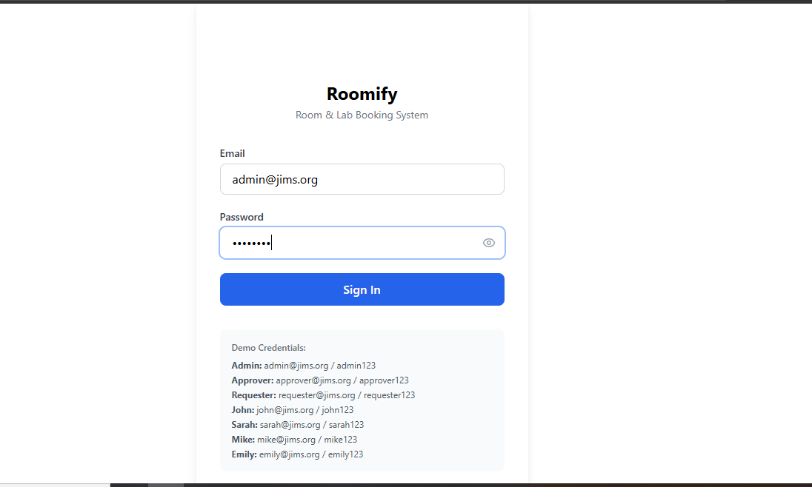
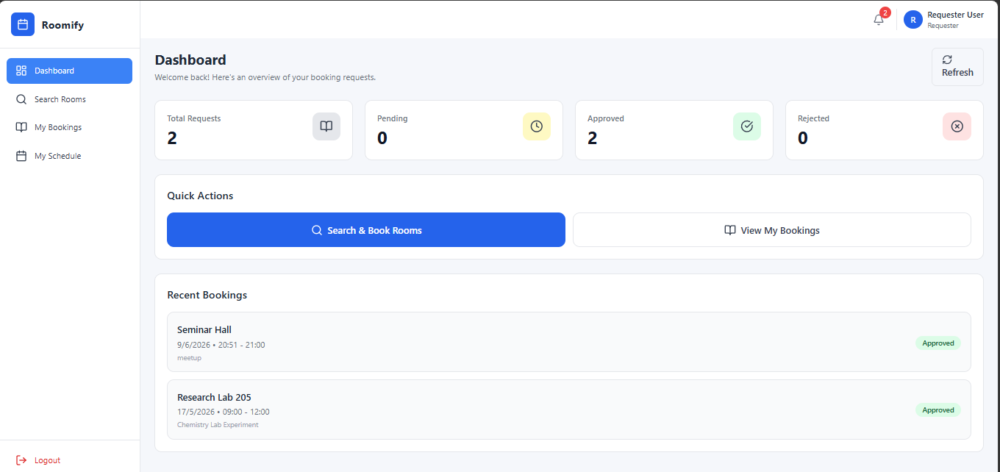
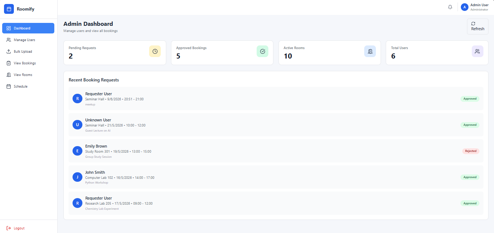

🚀 Roomify - Room & Lab Booking Management System

Roomify is a full-stack web application designed to streamline room and laboratory booking processes within educational institutions and organizations. The platform enables users to request bookings, approvers to review requests, and administrators to manage resources efficiently through a centralized dashboard.

📌 Overview

Managing room and laboratory reservations manually often leads to scheduling conflicts, approval delays, and poor resource utilization. Roomify provides a digital solution with role-based access control, automated workflows, and real-time booking management.

✨ Key Features
🔐 Authentication & Authorization
Secure JWT-based authentication
Role-Based Access Control (RBAC)
Separate dashboards for Admin, Approver, and Requester

🏢 Room & Lab Management
Create and manage rooms/laboratories
View room availability
Search and filter resources
Manage room details and capacity

📅 Booking Management
Submit booking requests
Approval/Rejection workflow
Booking history tracking
Schedule visualization

👨‍💼 Admin Panel
User management
Room management
Booking oversight
Bulk room uploads
Dashboard analytics

🔔 Notifications
Booking status updates
Approval notifications
Upcoming booking reminders

📱 Modern User Experience
Responsive design
Clean dashboard interface
Mobile-friendly layouts
Fast and intuitive navigation

🛠️ Technology Stack
Frontend
React.js
Vite
Tailwind CSS
React Router DOM
Context API
Backend
Node.js
Express.js
MongoDB Atlas
Mongoose
JWT Authentication
Deployment
GitHub
Render (Backend)
Vercel (Frontend)

📂 Project Architecture
Roomify
│
├── frontend/          # React Application
├── backend/           # Express API Server
├── README.md
├── package.json
└── .gitignore

🔄 System Workflow
User logs into the system.
Requester submits a room/lab booking request.
Approver reviews the request.
Booking is approved or rejected.
Notifications are sent to relevant users.
Admin monitors bookings and resources through the dashboard.

Login Page

Requester Dashboard

Admin Dashboard

⚙️ Installation & Setup
Clone Repository
git clone https://github.com/baisoyamehak-gif/roomify-room-booking-system.git
cd roomify-room-booking-system

Backend Setup
cd backend
npm install
npm start

Frontend Setup
cd frontend
npm install
npm run dev

🔑 Environment Variables
Backend (.env)
MONGODB_URI=your_mongodb_connection_string
JWT_SECRET=your_secret_key
PORT=5000
Frontend (.env)
VITE_API_URL=your_backend_api_url

👩‍💻 Author

Mehak Baisoya
MCA Student | Full Stack Developer